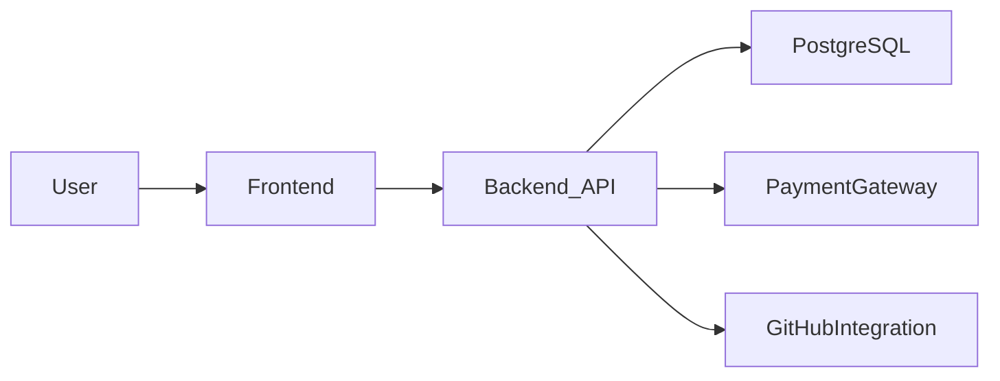

## FreelanceTrace

FreelanceTrace is a platform for managing freelance projects end‑to‑end: posting requirements, tracking bids and milestones, handling payments, and resolving disputes between clients and freelancers.

This README is written to help you (or any new contributor) **set up, configure, and run the project locally** as quickly as possible.

---

### Features

- **Project management**: Clients can create projects, define requirements, and track progress.
- **Bidding workflow**: Freelancers can browse projects and place bids.
- **Milestones & deliverables**: Break work into milestones and monitor completion.
- **Payments**: Integrates with payment gateways for secure client–freelancer transactions.
- **Disputes & moderation**: Admin tools for handling disputes and monitoring platform health.
- **GitHub integration (optional)**: Sync commits and activity to projects for better traceability.

---

### Tech Stack

- **Frontend**
  - Vite + React + TypeScript
  - Tailwind CSS + shadcn/ui components
  - React Router, React Query
  - State management and API fetching (React Router, React Query)

- **Backend**
  - Flask (Python)
  - PostgreSQL as the primary database

- **Infrastructure & Tooling**
  - Docker + Docker Compose for local orchestration
  - Vitest / Testing Library for frontend tests
  - ESLint + TypeScript for linting and type safety

---

### Project Structure

- `frontend/` – Vite + React dashboard (primary web app)
- `backend/` – Flask backend service
- `frontend_backup/` – Legacy Next.js web portal (kept as a backup; not required for core setup)
- `docker-compose.yml` – Docker services for Postgres, backend, and frontend

---

### Quick Start

If you just want to **run everything with Docker**:

```bash
docker compose up --build
```

Then open:

- Frontend: `http://localhost:8080`
- Backend API: `http://localhost:8000`
- Postgres: accessible on `localhost:5433`

For a non‑Docker local setup, see **Detailed Setup** below.

---

### Prerequisites

- **Required**
  - Git
  - Docker & Docker Compose (recommended for easiest setup)
  - Or, for manual setup:
    - Node.js (LTS, e.g. 18+)
    - Python 3.10+ (for Flask backend)
    - PostgreSQL (optional if not using Docker)

  - Accounts/keys for:
    - Payment gateway (e.g., Razorpay)
    - GitHub OAuth app (for GitHub integration)

---

### Cloning the Repository

```bash
git clone <your-fork-or-clone-url> freelancetrace
cd freelancetrace
```

---

### Environment Variables

> **Important:** Never commit real secret values. Use `.env` files locally and keep them out of version control.

Depending on how you run the project, you will typically have:

- **Backend (`backend/.env` or OS environment)**
  - `DATABASE_URL` – connection string to PostgreSQL.
    - Example (matches Docker Compose network):
      - `postgresql://postgres:mysecretpassword@db:5432/freelancetrace`
    - Example (local non‑Docker):
      - `postgresql://postgres:<password>@localhost:5433/freelancetrace`
  - `GITHUB_WEBHOOK_SECRET` - secret used to verify GitHub webhook signatures.
  - `WEBHOOK_BASE_URL` - public URL (e.g., ngrok) that points to this backend.
  - `GITHUB_OAUTH_CLIENT_ID` - GitHub OAuth app client ID.
  - `GITHUB_OAUTH_CLIENT_SECRET` - GitHub OAuth app client secret.
  - `GITHUB_OAUTH_REDIRECT_URI` - OAuth callback URL (usually `http://localhost:8000/github/oauth/callback`).
  - `GITHUB_OAUTH_SUCCESS_REDIRECT` - where to send users after OAuth (usually `http://localhost:8080`).
  - Other backend‑specific keys as needed (e.g., payment gateway).

- **Frontend (`frontend/.env` or `frontend/.env.local`)**
  - Typical values (names may vary by implementation; update to match your actual config):
    - `VITE_ENABLE_METRICS_WS` - set to `true` only if the backend exposes WebSocket metrics.
    - `VITE_API_BASE_URL` – base URL for the backend API (e.g., `http://localhost:8000`).
    - `VITE_GITHUB_CLIENT_ID` – GitHub OAuth client ID (if GitHub integration is enabled).
    - `VITE_RAZORPAY_KEY_ID` – public key for Razorpay (or your payment provider).

Document your exact keys in a local `.env.example` if you create one, so others can follow the same structure.

---

### Running with Docker (Recommended)

1. **Ensure Docker Desktop is running.**
2. From the repository root:

   ```bash
   docker compose up --build
   ```

3. Access services:
   - Frontend: `http://localhost:8080`
   - Backend: `http://localhost:8000`
   - Postgres: host `localhost`, port `5433`, database `freelancetrace`, user `postgres`, password `mysecretpassword` (as defined in `docker-compose.yml`).

4. To stop the stack:

   ```bash
   docker compose down
   ```

---

### Running Locally Without Docker

You can also run **frontend** and **backend** directly on your machine.

#### Backend (Flask)

1. Create and activate a virtual environment:

   ```bash
   cd backend
   python -m venv venv
   # On Windows (PowerShell):
   .\venv\Scripts\Activate.ps1
   # Or:
   # .\venv\Scripts\activate
   ```

2. Install dependencies:

   ```bash
   pip install -r requirements.txt
   ```

3. Ensure your `DATABASE_URL` (and other required env vars) are set in `backend/.env` or your shell.

4. Start the Flask app:

   ```bash
   python -m flask --app main run --host 0.0.0.0 --port 8000 --debug
   ```

   The backend will be available at `http://localhost:8000`.

#### Frontend (Vite + React)

1. Install dependencies:

   ```bash
   cd frontend
   npm install
   ```

2. Ensure your frontend `.env` is configured (e.g., `VITE_API_BASE_URL`, etc.).

3. Start the dev server:

   ```bash
   npm run dev
   ```

4. Open the URL shown in the console (typically `http://localhost:5173`) to use the app.

---

### Running Tests

#### Frontend

From `frontend/`:

```bash
npm run test
```

or, for watch mode:

```bash
npm run test:watch
```

#### Backend

If backend tests are configured (e.g., with `pytest`), you would typically run:

```bash
cd backend
pytest
```

Check the backend directory for the exact testing setup and update this section if you add or rename test commands.

---

### High‑Level Architecture

At a high level, FreelanceTrace consists of a **React frontend**, a **Flask backend**, a **PostgreSQL database**, and optional integrations like Razorpay and GitHub.



- The **frontend** handles all UI flows (authentication, browsing projects, creating bids, dashboards).
- The **backend** exposes REST APIs for projects, bids, milestones, payments, and disputes.
- **PostgreSQL** stores core application data.
- **Payment gateways** (e.g., Razorpay) handle payment initiation and webhooks.
- **GitHub integration** (if configured) can sync repository activity to relevant projects.

---

### Notes & Next Steps

- If you add new services, scripts, or environment variables, update this README so others can replicate your setup.
- Consider adding:
  - A `CONTRIBUTING.md` for contribution guidelines.
  - A `LICENSE` file if you plan to open‑source the project.
  - A more detailed architecture or SEPM‑style project document if required by your course.

FreelanceTrace is still evolving; treat this README as a living document and keep it in sync with the codebase.
